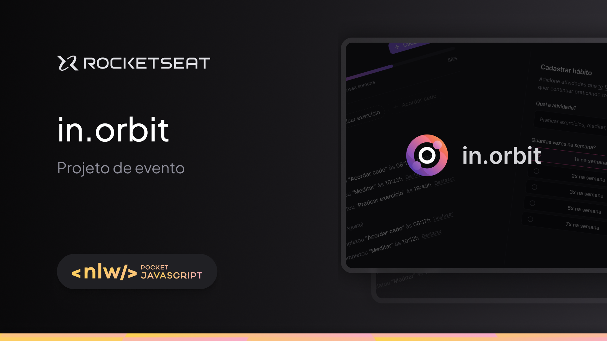

# in.Orbit

# Next Level Week

A **Next Level Week** é um evento gratuito de programação na prática da Rocketseat, com o objetivo de desenvolver um projeto completo em uma semana, aprendendo novas tecnologias, desenvolvendo novas habilidades e evoluindo para o próximo nível como desenvolvedor.

## O projeto

**in.Orbit** é uma aplicação para gerenciamento de metas, e é o projeto desenvolvido durante a edição do evento conhecida como **NLW Pocket Javascript**.

## Tecnologias

O presente projeto foi desenvolvido na trilha intermediária do evento, utilizando tecnologias como:

- NodeJS
- Fastify
- Zod
- Docker
- Postgresql
- Drizzle ORM
- ReactJS
- Entre outras...